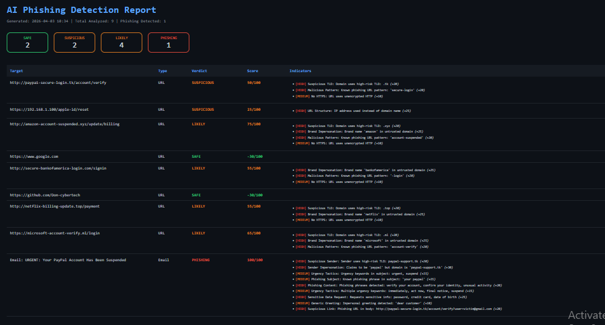

# 🎣 AI Phishing Detector — Python-Based Phishing Detection & Analysis Tool


> A Python-based phishing detection tool that analyzes URLs, email headers, email body content, and extracted links using heuristic scoring and pattern matching — assigning a 0-100 phishing risk score with verdicts of SAFE, SUSPICIOUS, LIKELY, or PHISHING.

---

## Screenshot



---

## 📌 Table of Contents

- [Overview](#overview)
- [Features](#features)
- [How It Works](#how-it-works)
- [Detection Techniques](#detection-techniques)
- [Installation](#installation)
- [Usage](#usage)
- [Sample Output](#sample-output)
- [HTML Report](#html-report)
- [Project Structure](#project-structure)
- [Legal Disclaimer](#legal-disclaimer)
- [Skills Demonstrated](#skills-demonstrated)
- [Future Improvements](#future-improvements)
- [Author](#author)

---

## Overview

AI Phishing Detector is a heuristic-based phishing detection tool that analyzes URLs and emails for signs of phishing attacks. It uses pattern matching, keyword detection, domain analysis, and scoring logic to determine whether a target is safe or malicious.

It supports four input modes:
- **`--url`** — analyze a single URL
- **`--email`** — analyze a `.eml` email file
- **`--list`** — analyze a text file containing multiple URLs
- **`--demo`** — run a built-in demo with real-world phishing samples

---

## Features

| Feature | Detail |
|---|---|
| 🔗 URL Analysis | IP addresses, suspicious TLDs, brand impersonation, homoglyph attacks |
| 📧 Email Header Analysis | Sender spoofing, Reply-To mismatch, brand impersonation |
| 📝 Email Body Analysis | Phishing keywords, urgency tactics, sensitive data requests |
| 🔍 Link Extraction | Finds and analyzes all URLs embedded in email body |
| ⚖️ Risk Scoring | 0-100 phishing risk score with four verdict levels |
| 🎯 Brand Detection | Detects 23 impersonated brands including PayPal, Apple, Amazon |
| 🌐 TLD Analysis | Flags 17 high-risk TLDs commonly used in phishing |
| 📊 HTML Report | Dark-themed report with verdict badges and indicator breakdown |
| 🔁 Trusted Domain Whitelist | Reduces false positives for known legitimate domains |
| 📦 Zero Dependencies | Built entirely on the Python standard library |

---

## How It Works

```
┌─────────────────────────────────────────┐
│              Input Sources               │
│  ┌────────┐ ┌────────┐ ┌──────┐ ┌────┐  │
│  │  URL   │ │ Email  │ │ List │ │Demo│  │
│  └───┬────┘ └───┬────┘ └──┬───┘ └─┬──┘  │
└──────┼──────────┼─────────┼────────┼─────┘
       │          │         │        │
       ▼          ▼         ▼        ▼
┌─────────────┐  ┌──────────────────────┐
│ URLAnalyzer │  │    EmailAnalyzer      │
│             │  │  ├── Header analysis  │
│ 12 checks   │  │  ├── Body analysis    │
│             │  │  └── Link extraction  │
└──────┬──────┘  └──────────┬───────────┘
       │                    │
       └──────────┬─────────┘
                  │ PhishingResult objects
                  ▼
         ┌─────────────────┐
         │  Risk Scoring    │
         │  0-100 score     │
         │  SAFE/SUSPICIOUS │
         │  LIKELY/PHISHING │
         └────────┬────────┘
                  │
                  ▼
         ┌─────────────────┐
         │ ReportGenerator  │  Dark-themed HTML report
         └─────────────────┘
```

### Verdict Scale

| Score | Verdict | Meaning |
|---|---|---|
| 0 – 20 | SAFE | No significant phishing indicators detected |
| 21 – 50 | SUSPICIOUS | Some indicators present — exercise caution |
| 51 – 75 | LIKELY | Strong phishing indicators — likely malicious |
| 76 – 100 | PHISHING | Confirmed phishing indicators — do not interact |

---

## Detection Techniques

### 🔗 URL Analysis (12 checks)

| Check | Score | Severity |
|---|---|---|
| IP address used instead of domain | +25 | HIGH |
| Suspicious TLD (`.tk`, `.ml`, `.xyz`, etc.) | +20 | HIGH |
| Brand name in subdomain of untrusted domain | +30 | HIGH |
| Brand name in untrusted domain | +25 | HIGH |
| @ symbol in URL to hide real destination | +20 | HIGH |
| Homoglyph / Unicode lookalike characters | +25 | HIGH |
| Known malicious URL pattern | +20 | HIGH |
| Excessive subdomains | +15 | MEDIUM |
| Double dash in domain | +10 | MEDIUM |
| URL length over 100 characters | +10 | MEDIUM |
| Unencrypted HTTP | +10 | MEDIUM |
| Trusted domain whitelist match | -30 | LOW |

### 📧 Email Header Analysis

| Check | Score | Severity |
|---|---|---|
| Sender domain differs from Reply-To domain | +25 | HIGH |
| Sender uses high-risk TLD | +20 | HIGH |
| Claims to be a brand but domain doesn't match | +30 | HIGH |
| Urgency keywords in subject line | +15 | MEDIUM |
| Known phishing phrases in subject | +15 | MEDIUM |

### 📝 Email Body Analysis

| Check | Score | Severity |
|---|---|---|
| Phishing phrases detected in body | +20 | HIGH |
| Requests sensitive information (password, card, SSN) | +25 | HIGH |
| Suspicious links found in body | +20 | HIGH |
| Link display text mismatches actual URL | +20 | HIGH |
| Multiple urgency keywords | +15 | MEDIUM |
| Generic greeting (Dear Customer, Dear User) | +10 | MEDIUM |

---

## Installation

No third-party packages required. Runs on the **Python standard library only**.

```bash
# 1. Clone the repository
git clone https://github.com/Don-cybertech/ai_phishing_detector.git
cd ai_phishing_detector

# 2. Confirm Python version (3.8+ required)
python3 --version

# 3. Run directly — no pip install needed
python3 ai_phishing_detector.py --help
```

---

## Usage

### Run built-in demo
```bash
python3 ai_phishing_detector.py --demo --report report.html
```

### Analyze a single URL
```bash
python3 ai_phishing_detector.py --url "http://paypa1-secure-login.tk/verify" --report report.html
```

### Analyze an email file
```bash
python3 ai_phishing_detector.py --email suspicious.eml --report report.html
```

### Analyze a list of URLs
```bash
python3 ai_phishing_detector.py --list urls.txt --report report.html
```

### Combine URL and email analysis
```bash
python3 ai_phishing_detector.py --url "http://example.tk" --email suspicious.eml --report report.html
```

### CLI Reference

| Argument | Description |
|---|---|
| `--url URL` | Single URL to analyze |
| `--email FILE` | Path to .eml email file |
| `--list FILE` | Text file with one URL per line |
| `--demo` | Run demo with built-in phishing samples |
| `--report HTML` | Save HTML report to this file |

---

## Sample Output

```
╔══════════════════════════════════════════════╗
║          AI Phishing Detector v1.0           ║
║          Author: Egwu Donatus Achema         ║
╚══════════════════════════════════════════════╝

[*] Running demo analysis...

--- URL Analysis ---

Target  : http://paypa1-secure-login.tk/account/verify
Type    : URL
Verdict : PHISHING (Score: 85/100)

Indicators:
  [HIGH] Suspicious TLD: Domain uses high-risk TLD: .tk (+20)
  [HIGH] Brand Impersonation: Brand name 'paypal' in untrusted domain (+25)
  [HIGH] Malicious Pattern: Known phishing URL pattern: 'secure-login' (+20)
  [MEDIUM] No HTTPS: URL uses unencrypted HTTP (+10)

Target  : https://www.google.com
Type    : URL
Verdict : SAFE (Score: 0/100)

════════════════════════════════════════════════════════════
  ANALYSIS COMPLETE
════════════════════════════════════════════════════════════
  Total Analyzed : 9
  Phishing       : 1
  Likely         : 4
  Suspicious     : 2
  Safe           : 2
════════════════════════════════════════════════════════════

[+] Report saved → report.html
```

---

## HTML Report

The HTML report includes:
- Verdict badge summary (PHISHING / LIKELY / SUSPICIOUS / SAFE counts)
- Per-target rows with verdict, risk score, and full indicator breakdown
- Colour-coded severity for each indicator (RED=HIGH, ORANGE=MEDIUM, GREEN=LOW)

---

## Project Structure

```
ai_phishing_detector/
├── ai_phishing_detector.py  # Entire detector (single file)
├── report.html              # HTML report (generated on demand)
├── report_screenshot.png    # Screenshot of the HTML report
└── README.md
```

---

## Legal Disclaimer

> This tool is for educational and defensive security purposes only.
> Use it to analyze URLs and emails you own or have permission to test.
> Do not use this tool to facilitate phishing attacks.

---

## Skills Demonstrated

- **Phishing Detection** — Heuristic scoring across 18+ detection checks
- **Email Parsing** — MIME email parsing including multipart bodies and encoded headers
- **URL Analysis** — Domain parsing, TLD checking, and pattern matching
- **Regex Engineering** — Multiple compiled patterns for URL, keyword, and link detection
- **Scoring System** — Weighted indicator scoring with threshold-based verdicts
- **OOP Design** — Clean class-based architecture with separation of concerns
- **Report Generation** — Dark-themed HTML report with colour-coded findings
- **Standard Library Mastery** — `email`, `urllib`, `re`, `html.parser`, `argparse`, `pathlib`

---

## Future Improvements

- [ ] VirusTotal API integration for URL reputation lookup
- [ ] WHOIS domain age checking
- [ ] Machine learning classifier trained on phishing datasets
- [ ] Real-time email monitoring via IMAP
- [ ] Browser extension integration
- [ ] Bulk email scanning from mailbox export

---

## Author

**Egwu Donatus Achema** — Cybersecurity Student | Python Developer
- GitHub: [@Don-cybertech](https://github.com/Don-cybertech)

> *"Think before you click."*

---

## License

This project is licensed under the **MIT License** — free to use, modify, and share with attribution.
